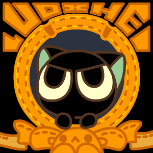

<h1 align="center">Привет, я Сергей!
    
</h1>
<h3 align="center">Это приложение для моего портфолио</h3>
<h3 align="center">👀 Что это и для чего?</h3>

Цель, которую я преследовал в этом приложении, заключается в создании сервера, где реализованы серверные технологии, и в выполнении CRUD — четырех основных функций работы с базой данных: создание, чтение, обновление, удаление.

<h3 align="center">🛠 <u>Описание проекта для портфолио</u></h3>

Технологический стек в проекте для <b>Back</b>:

<ul>
<li>Node.js / ES6</li>
<li>Express (настройка веб-сервера)</li>
<li>Validator (валидация запросов)</li>
<li>MongoDB / Mongoose (управление базой данных)</li>
<li>JSON Web Token (аутентификация/авторизация)</li>
<li>Multer (загрузка файлов/изображений)</li>
<li>BCrypt (шифрование паролей)</li>
</ul>

Технологический стек в проекте для <b>Front</b>:

<ul>
<li>ReactJS</li>
<li>Redux Toolkit (хранение данных)</li>
<li>React Router v6 (навигация)</li>
<li>Axios + Fetch (отправка запросов на бэкенд)</li>
<li>React Hooks (хуки)</li>
<li>Prettier (форматирование кода)</li>
<li>CSS-Modules / SCSS (стилизация)</li>
<li>React Content Loader (скелетон)</li>
<li>React Pagination (пагинация)</li>
<li>Lodash.Debounce</li>
<li>Code Splitting, React Loadable, useWhyDidYouUpdate</li>
</ul>

<h3 align="center">👀 <u>Разработанная клиентская часть (папка FullStackReactJs_Front):</u></h3>
<ul>
<li>Использует React, Redux и React Router.</li>
</ul>

<h3 align="center">👀 Реализованные страницы:</h3>
<ul>
<li>Авторизация (Login)</li>
<li>Регистрация</li>
<li>Создание статей</li>
<li>Лента статей (Главная)</li>
</ul>

<h3 align="center">👀 Компоненты:</h3>
<ul>
<li>Интеграция Material UI</li>
<li>Заголовок</li>
<li>Скелетон</li>
<li>ComponentBlock</li>
<li>Главная</li>
<li>FullPost</li>
</ul>

<h3 align="center">👀 Выполненные шаги:</h3>
<ul>
<li>Подключение React Router</li>
<li>Интеграция Redux Toolkit</li>
<li>Создание среза для статей (постов)</li>
<li>Настройка Axios</li>
<li>Исправление ошибок CORS</li>
<li>Создание асинхронных действий в Redux Toolkit</li>
<li>Хранение статуса запроса и статей в состоянии</li>
<li>Отображение полной статьи</li>
<li>Реализация функционала авторизации</li>
<li>Добавление формы регистрации</li>
<li>Разрешение авторам удалять свои статьи</li>
<li>Создание формы для статей с Simple Editor</li>
<li>Загрузка изображений на сервер</li>
<li>Отправка статьи на бэкенд</li>
<li>Отображение статьи с использованием React Markdown</li>
<li>Удаление статьи</li>
<li>Редактирование статьи</li>
</ul>

<h4>**Примечание: Приложение работает только при наличии сервера и подключения к базе данных!</h4>

<h3 align="center">👀 <u>Разработанная серверная часть (папка FullStackNodeJs_Server):</u></h3>
<ul></ul>
<li>Аутентификация с использованием JSON Web Token (JWT).</li>
</ul>
<h3 align="center">👀 Реализованные функции:</h3>
<ul></ul>
<li>Авторизация (Login)</li>
<li>Регистрация</li>
<li>Подключение к базе данных MongoDB</li>
<li>Шифрование паролей с помощью BCrypt</li>
<li>Функционал для статей (CRUD)</li>
<li>Загрузка изображений на сервер с помощью Multer</li>
</ul>

<h3 align="center">👀 Выполненные шаги:</h3>
<ul>
<li>Установка библиотеки Express</li>
<li>Настройка HTTP-запросов для приложения</li>
<li>Создание тестовой авторизации</li>
<li>Интеграция JSON Web Token (JWT)</li>
<li>Добавление регистрации и подключение к базе данных MongoDB</li>
<li>Создание модели пользователя (UserModel)</li>
<li>Интеграция и настройка Express Validator</li>
<li>Добавление пользователя в базу данных</li>
<li>Шифрование паролей с помощью BCrypt</li>
<li>Подключение к MongoDB (через MongoDB Compass)</li>
<li>Обработка ошибок</li>
<li>Разработка системы авторизации</li>
<li>Создание маршрута для получения информации о профиле</li>
<li>Реализация CRUD-функционала для статей</li>
<li>Настройка загрузки изображений на сервер с помощью Multer</li>
<li>Возврат статических файлов (загруженные изображения)</li>
</ul>
<h4>**Примечание: Сервер должен быть запущен перед запуском приложения.</h4>

 
<h5 font-family: Arial, Helvetica, sans-serif font-weight: bold><u>
***Детальные инструкции по установке, эксплуатации, деплоя БЭКА и ФРОНТА вы можете запросить как сами приложения также и код отдельных решений по почте sergeyif1@gmail.com

С уважением!
</u></h5>